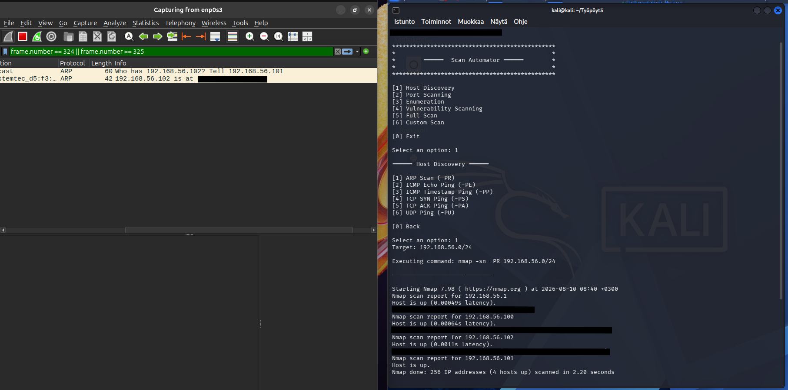
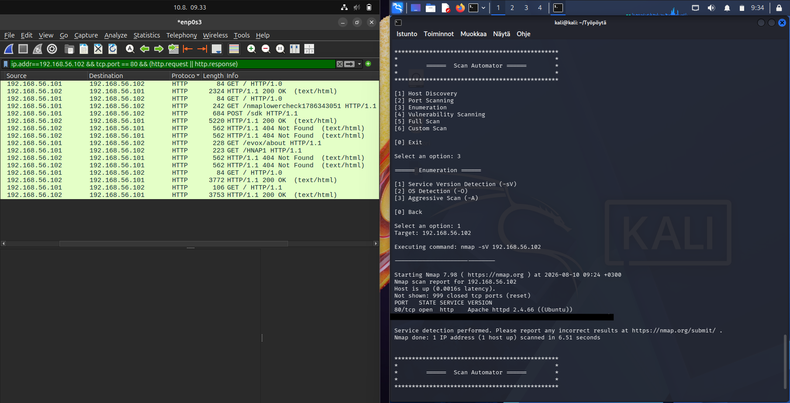

# Scan Automator

A simple Python CLI tool that provides a menu-driven interface for running common [Nmap](https://nmap.org/) scans.

Scan Automator makes it easier to run different types of Nmap scans without having to remember the syntax for every command. Users can select a scan category, choose a scan type, enter a target, and the program automatically builds and executes the corresponding Nmap command.

## Features

- Host Discovery
- TCP & UDP Port Scanning
- Service & Version Detection
- OS Detection
- Vulnerability Scanning
- Full Scanning
- Custom Nmap Scans

> **⚠️ Disclaimer:** Only scan systems, networks, and devices that you own or have explicit permission to test. Unauthorized scanning may be illegal or disruptive. The author takes no responsibility for any illegal, unauthorized, or malicious use of this software.

> This project is not affiliated with or endorsed by the Nmap Project.

## Requirements

- Python 3
- [Nmap](https://nmap.org/)

Scan Automator uses Nmap to perform the actual network scans.

## Installation 

Download the ZIP from Github or clone the following repository:

```bash
git clone https://github.com/Arttu-cyber/scan_automator
cd scan_automator
```

## Usage

To run the program, execute:

```bash
python3 scan_automator.py
```

> **Note:** Some Nmap scans may require elevated privileges. Running the program with elevated privileges would be recommended, this can be done in linux environment with sudo:

```bash
sudo python3 scan_automator.py
```

## Example

This example demonstrates the programs functionality using a virtual environment with several virtual machines connected to a host-only network.





## License

This project is licensed under the MIT License.